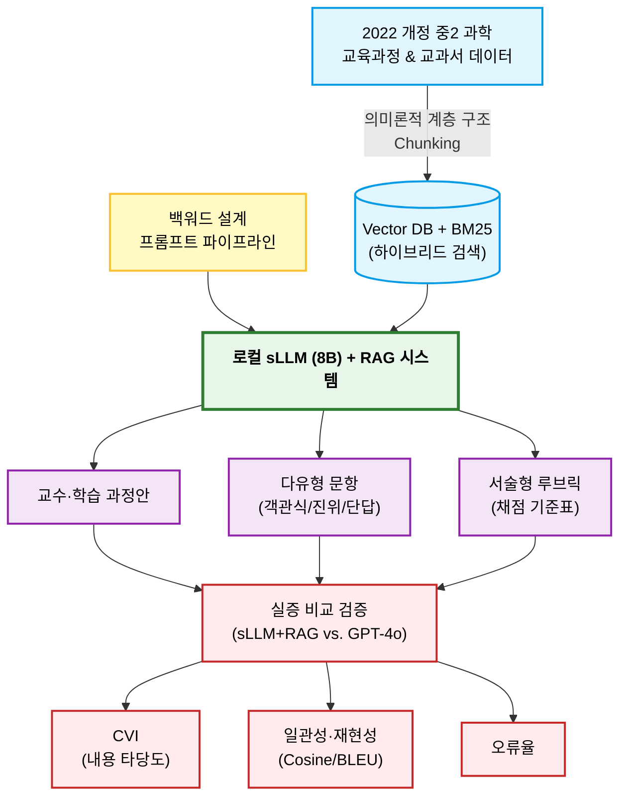

```mermaid
graph TD
    %% 스타일 정의
    classDef data fill:#e1f5fe,stroke:#039be5,stroke-width:2px,color:#000;
    classDef process fill:#fff9c4,stroke:#fbc02d,stroke-width:2px,color:#000;
    classDef system fill:#e8f5e9,stroke:#2e7d32,stroke-width:3px,font-weight:bold,color:#000;
    classDef output fill:#f3e5f5,stroke:#8e24aa,stroke-width:2px,color:#000;
    classDef eval fill:#ffebee,stroke:#c62828,stroke-width:2px,color:#000;

    %% 1단계: 데이터 및 전처리
    A["2022 개정 중2 과학<br>교육과정 & 교과서 데이터"] -->|"의미론적 계층 구조<br>Chunking"| B[("Vector DB + BM25<br>(하이브리드 검색)")]
    
    %% 2단계: 프롬프트 및 시스템
    C["백워드 설계<br>프롬프트 파이프라인"] --> D
    B --> D
    
    %% 3단계: 메인 시스템
    D["로컬 sLLM (8B) + RAG 시스템"]:::system
    
    %% 4단계: 산출물
    D --> E["교수·학습 과정안"]:::output
    D --> F["다유형 문항<br>(객관식/진위/단답)"]:::output
    D --> G["서술형 루브릭<br>(채점 기준표)"]:::output
    
    %% 5단계: 검증
    E & F & G --> H["실증 비교 검증<br>(sLLM+RAG vs. GPT-4o)"]:::eval
    
    %% 검증 항목 세부화
    H --> I["CVI<br>(내용 타당도)"]:::eval
    H --> J["일관성·재현성<br>(Cosine/BLEU)"]:::eval
    H --> K["오류율"]:::eval

    %% 클래스 적용
    class A data;
    class B data;
    class C process;

```
